# Owning Cats

Welcome to my homepage [Owning cats](https://mienjung97.github.io/Owning-Cats/index.html)

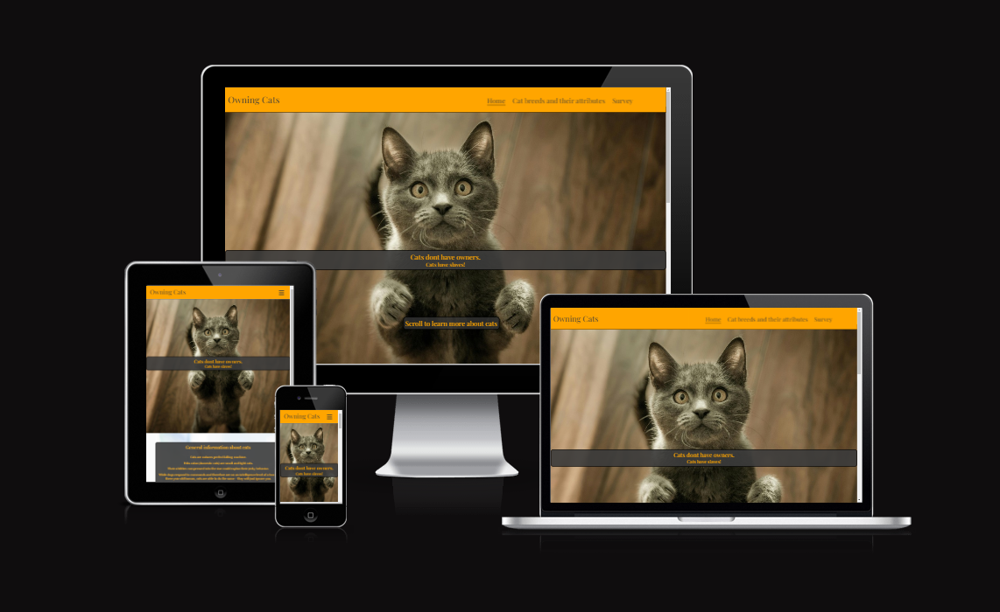

## Site Overview 

Owning Cats is a website to inform about cats, their traids and attributes. It lists pros and cons of owning cats, some necessary info for possible new owners and gives a guideline about breed specific attributes going along with pictures for visuals. The website also includes a form to ask the user about their ownership status and breed preferences, while signing them up for a (fictional) newsletter.

## Repository problems

On the last day before submitting, my Gitpod workspace had a bug and I was unsable to continue to code there. Gitpod logged me out of my github account, would not let me sign in again and therefore I was unable to push my commits. To fix the Problem, I opened a new Gitpod codespace, where I was logged in again.  

# Contents

1. [**Site Overview**](#site-overview)
2. [**Previous Repository**](#previous-repository)
3. [**Planning stage**](#planning-stage)
   - [**_Idea_**](#idea)
   - [**_Site aims_**](#site-aims)
   - [**_Target audience_**](#target-audience)
   - [**_Site Goals_**](#site-goals)
   - [**_How I will achieve my goals_**](#how-i-will-achieve-my-goals)
   - [**_Site Structure_**](#site-structure)
   - [**_Wireframes_**](#wireframes)
   - [**_Typography_**](#typography)
   - [**_Color scheme_**](#color-scheme)
4. [**Features**](#features)
   - [**_Navigation menu_**](<#navigation-menu>)
   - [**_Owning Cats_**](<#owning-cats>)
   - [**_Attributes_**](<#attributes>)
   - [**_Survey_**](<#survey>)
   - [**_Footer_**](<#footer>)
6. [**Elements used on all pages**](#elements-used-on-all-pages)
   - [**Header element**](#header-element)
   - [**_Navigation_**](#navigation)
   - [**Footer element**](#footer-element)
   - [**_Socials_**](#socials)
   
   - [**Home**](#home)
   - [**Techniques**](#techniques)
   - [**Contact**](#contact)
7. [**Testing**](#testing)
8. [**Deployment**](#deployment)
9. [**Credits**](#credits)
   - [**_Honorable mentions_**](#honorable-mentions)
   - [**_General reference_**](#general-reference)
   - [**_Content_**](#content)
   - [**_Media_**](#media)

# Planning stage 
## Idea 
- Cats are sometimes deeply misunderstood because of misconceptions about their behaviour
- Since I have owend cats my whole life, I personally know how these animals behave and why people often are afraid
- I want to guide people who are interested about cats to gain some knowledge about their different behaviour
- humor is supposed to be a leading cause since cats are often pure entertainment
## Site Aims 
- Give users more insight into different cat breeds
- Help user to decide if they want a cat / get more cats and determin which one 
- Let user participate in a survey about their ownership, preferences and opinion about the website while signing up for a newsletter
## Target Audiences 
- Users looking to inform themselves for the first time about cats
- Users who already have cats and want to widen their knowledge
- Users who want to sign up to the "Loving Cats" newsletter
## Site Goals 
- I expect that users will find the website visually pleasing and easy to navigate 
- The user is supposed to get the information they are looking for easy and quick
- The humor used in the website is supposed to make the user more interested to read the content and engage with the survey
## How will I achieve my Goals 
- With nice contrast colors and background colors for each written text will make navigation easier
- Media queries will make the website fully responsive, so any user will immediately find the content they are looking for
- Humor and cute cat pictures are supposted to keep the user engaged

[Back to top](<#contents>)

## Site Structure 
The website is structured into three pages, the homepage on which you will recieve general information about cats, an attributes page, which shows pictures of 9 different cat breeds and their usual behaviour and a survey about current ownership, future plans and preferences as a last page. The survey is set up to sign the user up for a fictional Newsletter as well.

## Wireframes  
The wireframes for Wawas Woods were produced in Balsamiq. There are frames for a full width display and a small mobile device. The final site varies slightly from the wireframes due to developments that occured during the creation process.

[Back to top](<#contents>)

## Typography 
- I have used the same Playfair display font from google fonts for the whole project

[Back to top](<#contents>)

## Color scheme 
For the webpage I have used orange, white, grey and black colors since they provide a good contrast as well as represent the mist common colors found in cats.   The following pictures show all individual colors I have used:
- White: 
- Grey:  
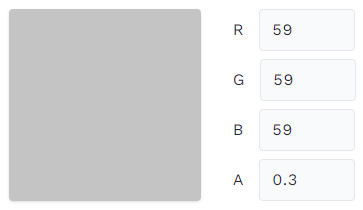
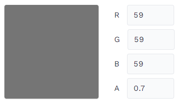
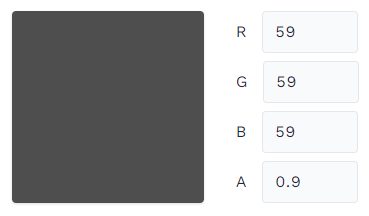
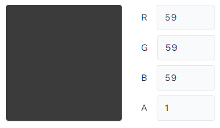
- Orange:  
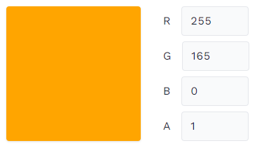
- Red and Green for Pros/Cons list:  
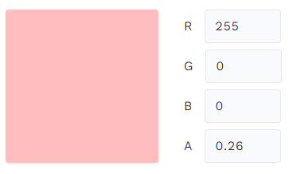

[Back to top](<#contents>)

# Features 

## Navigation menu 
- The Navigation menu was created with the help of the Love Running project, features a burger-icon drop-down-menu for smaller screens up to 992px, after which it will transform to a horizontal list. The Navigation bar has an indicator, on which side the user currently is on and will alsway redirect the user back to the homepage, as soon as they click the "Owning Cats" text in the header.
- Expanded Nav-bar:  
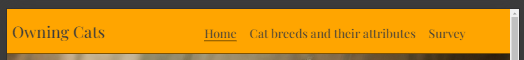
- Burger-Icon nav-bar:  
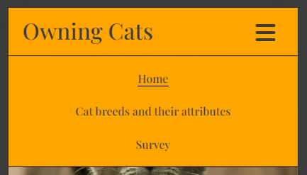
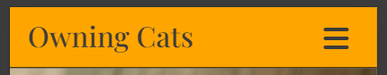

## Owning Cats 
- The homepage "Owning Cats" is giving the user general information about cats and a Pros and Cons list:  
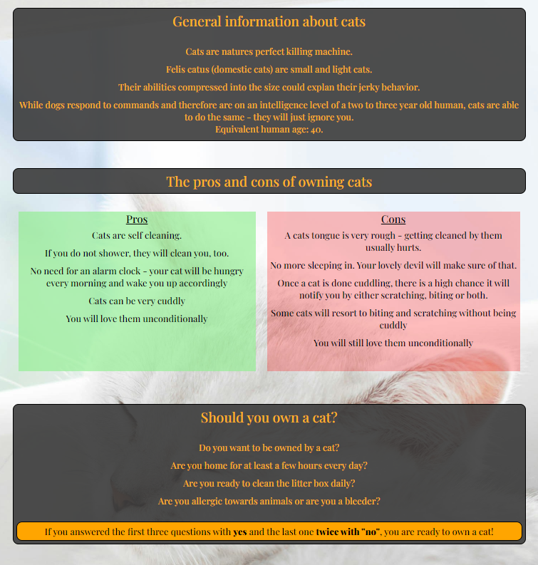

## Attributes 
- The Atrributes page is dedicated to show to the user nine different kind of cat breeds, the way they look and give a quick inside into their behaviour and traids:
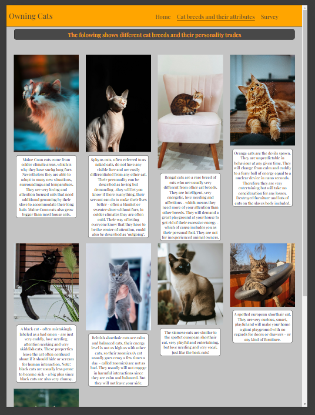

## Survey 
-
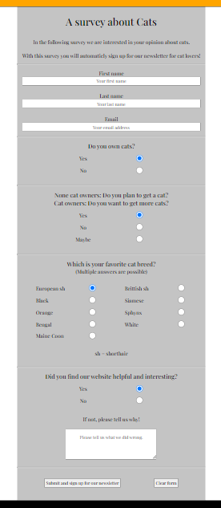

## Footer 
- Small screens:  
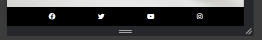
- Big screens  
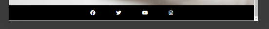

## Validation 
- CSS: https://jigsaw.w3.org/css-validator/validator
- HTML: https://validator.w3.org/nu/ 

[Back to top](<#contents>)

## Credits 

### Honorable mentions 
I have to thank my dear partner for being so patient since there is not a lot of free time and yet she fully supports me on a daily basis.  
I am also thankful for my co-student Marceillo, who I worked closly together and helped me in times of questioning.  
A big thank you goes out to the Tutors who have helped me along my first protfolio project: Alan and John helped me understand some problems, helped with technical problems and guided me towards a correct code. 

[Back to top](<#contents>)

### General reference: 
The biggest help and inspiration in my first project was my Mentor Akshat Garg who helped me a lot with understanding .parent - .child connections, how to implement them in a long css code and media queries.  
For the Header (Drop down menu) i took great inspiration from the "Love Running" project, the Footer has been compleatly copied since I really liked the design. Only for bigger screens, the Icons for the social media platforms move closer together.  
For creating this readme, I have used example readme files from [Ewan Colquhoun](https://github.com/EwanColquhoun) and my colleague [Marceillo](https://github.com/Marceillo) for the general overview.

[Back to top](<#contents>)