# Owning Cats

Welcome to my homepage [Owning cats](https://mienjung97.github.io/Owning-Cats/index.html)

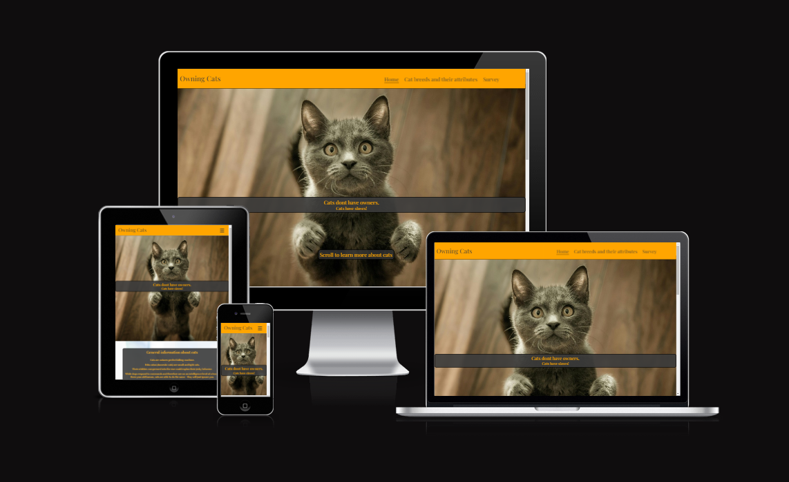

## Site Overview

Owning Cats is a website to inform about cats, their traids and attributes. It lists pros and cons of owning cats, some necessary info for possible new owners and gives a guideline about breed specific attributes going along with pictures for visuals. The website also includes a form to ask the user about their ownership status and breed preferences, while signing them up for a (fictional) newsletter.

# Contents

1. [**Site Overview**](<#site-overview>)
2. [**Planning stage**](<#planning-stage>)
   - [**_Idea_**](<#idea>)
   - [**_Site aims_**](<#site-aims>)
   - [**_Target Audience_**](<#target-audience>)
   - [**_Site Goals_**](<#site-goals>)
   - [**_How will I achieve my goals_**](<#how-will-i-achieve-my-goals>)
   - [**_Site Structure_**](<#site-structure>)
   - [**_Wireframes_**](<#wireframes>)
   - [**_Typography_**](<#typography>)
   - [**_Color scheme_**](<#color-scheme>)
3. [**Features**](<#features>)
   - [**_Navigation menu_**](<#navigation-menu>)
   - [**_Owning Cats Homepage_**](<#owning-cats-homepage>)
   - [**_Attributes_**](<#attributes>)
   - [**_Survey_**](<#survey>)
   - [**_Footer_**](<#footer>)
4. [**Technologies Used**](<#technologies-used>)
5. [**Testing**](<#testing>)
   - [**Repository problems**](<#repository-problems>)
   - [**Validation**](<#validation>)
   - [**Responsiveness Test**](<#responsiveness-test>)
   - [**Lighthouse**](<#lighthouse>)
   - [**Browser Compatibility**](<#browser-compatibility>)
6. [**Deployment**](<#deployment>)
7. [**Credits**](<#credits>)
   - [**_Honorable mentions_**](<#honorable-mentions>)
   - [**_General reference_**](<#general-reference>)
   - [**_Content_**](<#content>)
   - [**_Media_**](<#media>)

# Planning stage
## Idea 
- Cats are sometimes deeply misunderstood because of misconceptions about their behaviour
- Since I have owend cats my whole life, I personally know how these animals behave and why people often are afraid
- I want to guide people who are interested about cats to gain some knowledge about their different behaviour
- humor is supposed to be a leading cause since cats are often pure entertainment.
## Site Aims 
- Give users more insight into different cat breeds
- Help user to decide if they want a cat / get more cats and determin which one 
- Let user participate in a survey about their ownership, preferences and opinion about the website while signing up for a newsletter.
## Target Audience 
- Users looking to inform themselves for the first time about cats
- Users who already have cats and want to widen their knowledge
- Users who want to sign up to the "Loving Cats" newsletter.
## Site Goals 
- I expect that users will find the website visually pleasing and easy to navigate 
- The user is supposed to get the information they are looking for easy and quick
- The humor used in the website is supposed to make the user more interested to read the content and engage with the survey.
## How will I achieve my Goals 
- With nice contrast colors and background colors for each written text will make navigation easier
- Media queries will make the website fully responsive, so any user will immediately find the content they are looking for
- Humor and cute cat pictures are supposted to keep the user engaged.

[Back to top](<#contents>)

## Site Structure 
The website is structured into three pages, the homepage on which you will recieve general information about cats, an attributes page, which shows pictures of 9 different cat breeds and their usual behaviour and a survey about current ownership, future plans and preferences as a last page. The survey is set up to sign the user up for a fictional Newsletter as well.

## Wireframes 

The wireframes for "Owning Cats" were produced with [Balsamiq](https://balsamiq.com/). The following shows the basic design idea for mobile and desktop devices. The wireframes vary a bit from the actual webpage due to the development process.

- Desktop wireframes:  
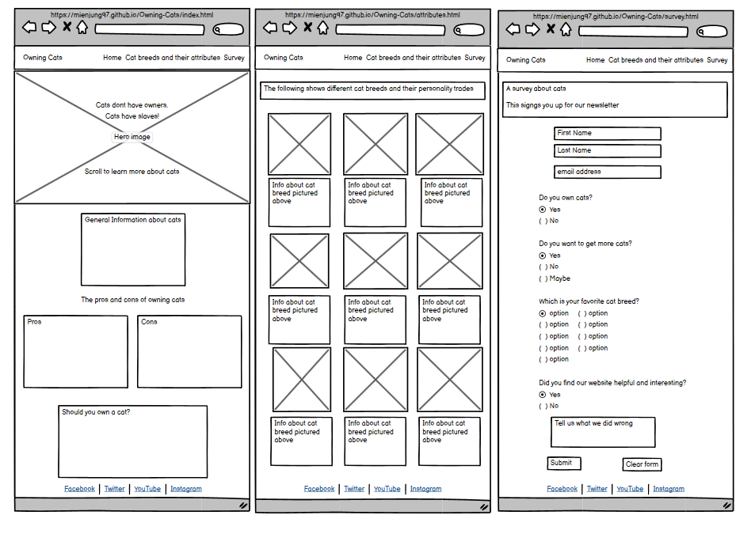 

- Mobile wireframes:  
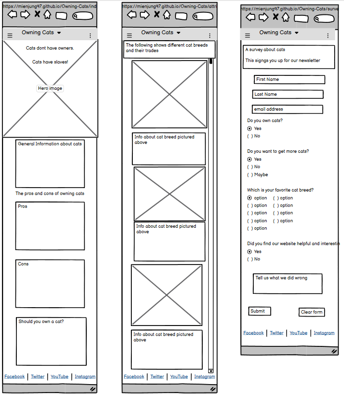
 
[Back to top](<#contents>)

## Typography 
- I have used the same Playfair display font from google fonts for the whole project.

[Back to top](<#contents>)

## Color scheme 
For the webpage I have used orange, white, grey and black colors since they provide a good contrast as well as represent the mist common colors found in cats.   The following pictures show all individual colors I have used:
- White:  
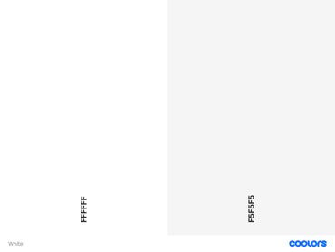  
Created with [Colors](https://coolors.co/gradient-palette/ffffff-f5f5f5?number=2)
- Grey:  
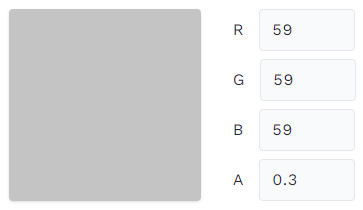
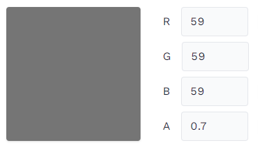

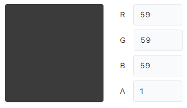
- Orange:  
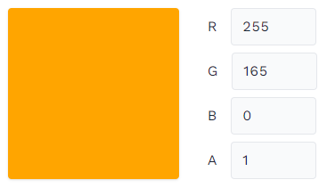
- Red and Green for Pros/Cons list:  
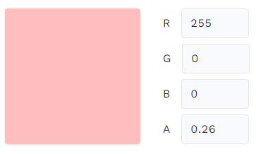
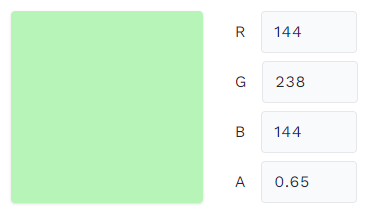  
Created with [rgbacolorpicker](https://rgbacolorpicker.com/)

[Back to top](<#contents>)

# Features 

## Navigation menu 
- The Navigation menu was created with the help of the Love Running project, features a burger-icon drop-down-menu for smaller screens up to 992px, after which it will transform to a horizontal list.   The Navigation bar has an indicator, on which side the user currently is on and will alsway redirect the user back to the homepage, as soon as they click the "Owning Cats" text in the header.
- Expanded Nav-bar:  
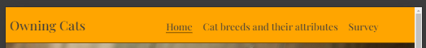
- Burger-Icon nav-bar:  
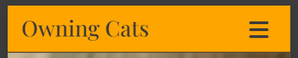
- Burger-Icon nav-bar with navigation links open:  
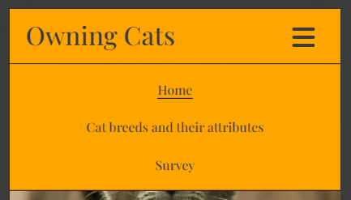

[Back to top](<#contents>)

## Owning Cats Homepage
- The homepage "Owning Cats" is giving the user general information about cats, a Pros and Cons list and some general guide if you should own a cat.  
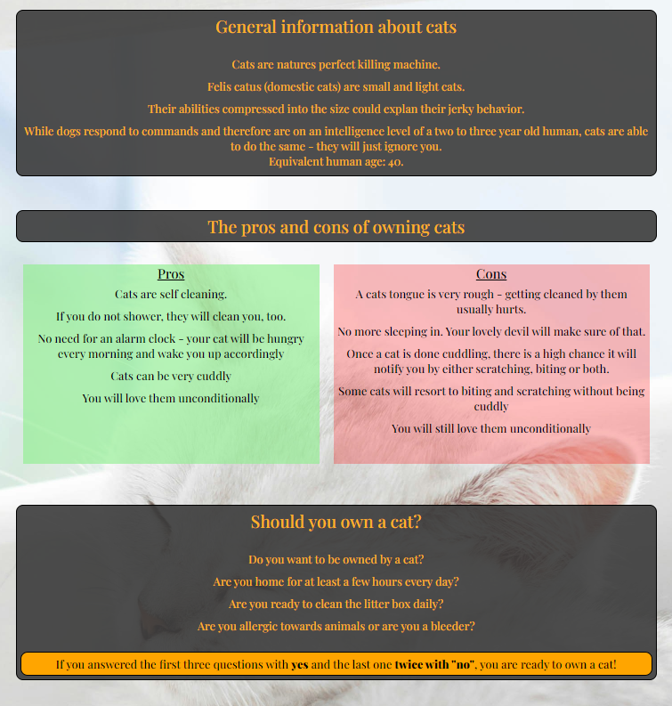

[Back to top](<#contents>)

## Attributes 
- The Atrributes page is dedicated to show to the user nine different kind of cat breeds, the way they look and give a quick inside into their behaviour and traids.
- The page is responsive and depending on the screen size, it will display between one and four breeds next to each other.  
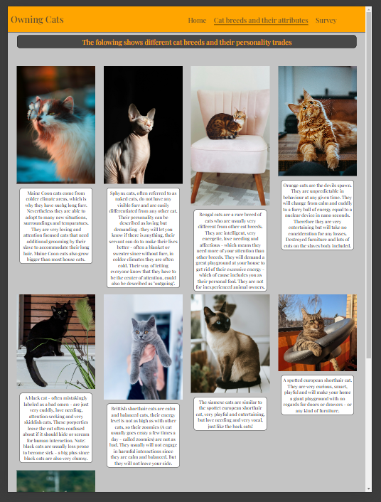

[Back to top](<#contents>)

## Survey 
- The Survey page is a form page that asks the user about their personal information, ownership status of cats, asking about future ownership, their favorite cat breed and automaticly signs the user up for the fictional "Loving Cats" newsletter. 
- The form is needs all inputs of Name and email address to be compleated.
- The form is send to the Code Institute dump site.  
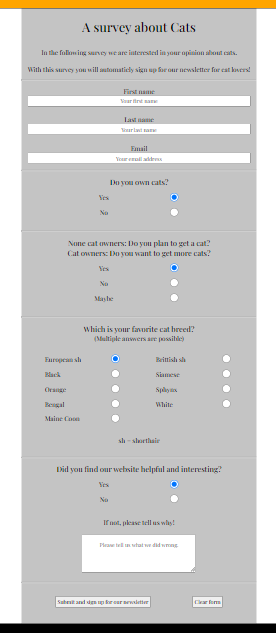

[Back to top](<#contents>)

## Footer 
- The footer has social media links in form of their corresponding icons which will open in a tab. 
- For small screens, the icons are evenly spaced over the whole footer:  
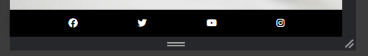
- For big screens, the icons are more centered in the middle of the footer:  
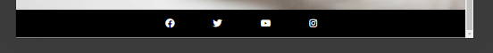

[Back to top](<#contents>)

# Technologies Used 
- [HTML5](https://html.spec.whatwg.org/) - provides the content and structure for the website.
- [CSS](https://www.w3.org/Style/CSS/Overview.en.html) - provides the styling.
- [Gitpod](https://www.gitpod.io/#get-started) - used to host and edit the website.
- [Github](https://github.com/) - used to deploy the website.
- [Balsamiq](https://balsamiq.com/wireframes/) - used to create the wireframes.

[Back to top](<#contents>)

# Deployment

The website was deployed on GitHub Pages following these steps:

1. Go to GitHub, navigate through Repository/settings/pages.
2. Select "main branch" in the source tab and click save.
3. The page should look like this, which includes the webpages address:  

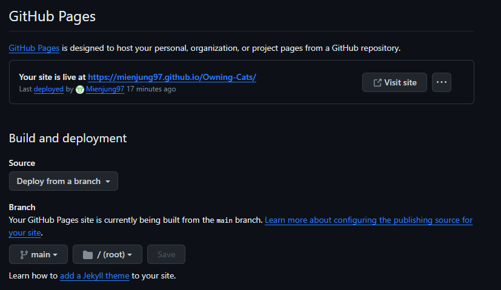

- Information on how to fork a project: [Fork the project](https://docs.github.com/en/pull-requests/collaborating-with-pull-requests/working-with-forks/fork-a-repo)

- Information on how to clone a project: [Clone the project](https://docs.github.com/en/repositories/creating-and-managing-repositories/cloning-a-repository) 

- Difference between clone and fork: "Forking creates your own copy of a repository in a remote location (for example, GitHub). Your own copy means that you will be able to contribute changes to your copy of the repository without affecting the original repository. Cloning makes a local copy of a repository, not your own copy." [Full explanation](https://www.educative.io/answers/what-is-the-difference-between-forking-and-cloning-in-git)

# Testing
- The Website was continiously testet for responsiveness and code validation. Therefore I was able to correct all the small mistakes like "wrong grid value" and other mistakes. 
- First I hard coded some of the widths and heights which resulted in problems with extra small screens (Galaxy Fold) and between 1200px and 1300px. Through guidance by my mentor, I was able to fix all the responsiveness bugs. 

## Repository problems

On the last day before submitting, my Gitpod workspace had a bug and I was unsable to continue to code there. Gitpod logged me out of my github account, would not let me sign in again and therefore I was unable to push my commits. To fix the Problem, I opened a new Gitpod codespace, where I was logged in again.  

[Back to top](<#contents>)

## Validation 

### HTML validation via [HTML-validator](https://validator.w3.org/nu/)
- index.html:  
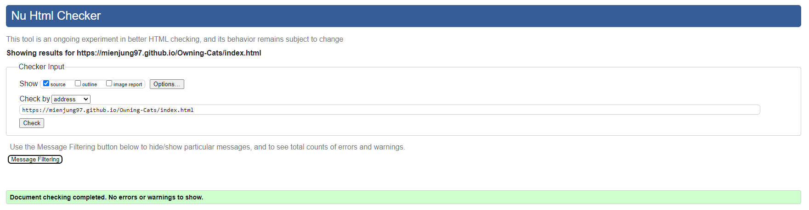
- attributes.html:  
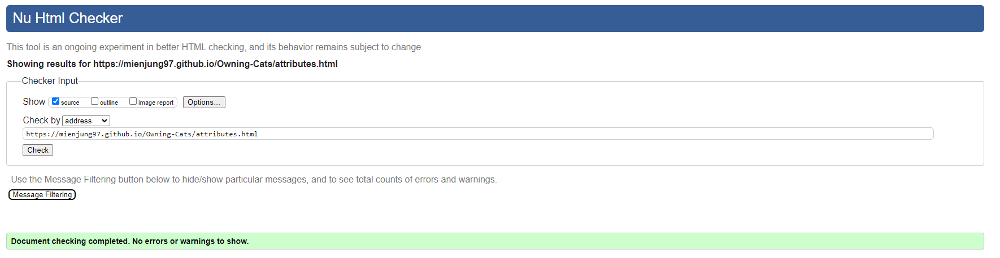
- survey.html:  
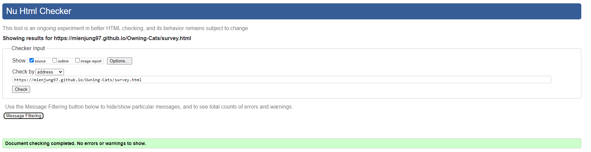

### CSS validation via [CSS-validator](https://jigsaw.w3.org/css-validator/validator)
- style.css:  
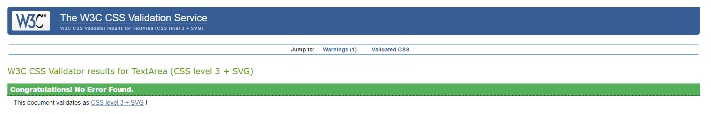

[Back to top](<#contents>)

## Responsiveness Test

- The responsive design tests were carried out manually with [Google Chrome DevTools](https://developer.chrome.com/docs/devtools/) and [Responsive Design Checker](https://www.responsivedesignchecker.com/).

|        | Galaxy Fold | Pixel 7   | iPhone 14 Pro Max | iPad Air | iPad Pro | Display <1200px | Display >1200px |
|--------|-------------|-----------|-------------------|----------|----------|-----------------|-----------------|
| Render |     pass    |   pass    |       pass        |   pass   |   pass   |      pass       |      pass       |
| Images |     pass    |   pass    |       pass        |   pass   |   pass   |      pass       |      pass       |
| Links  |     pass    |   pass    |       pass        |   pass   |   pass   |      pass       |      pass       |

[Back to top](<#contents>)

## Lighthouse 

- The website was tested with lighthouse for both mobile and dektop screens. These are the results:
- Mobile:  
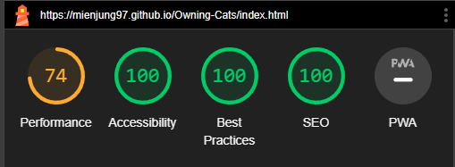
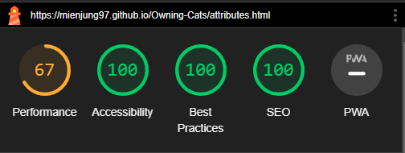
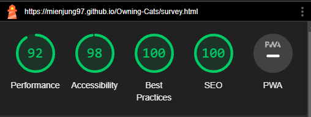
- Desktop:  
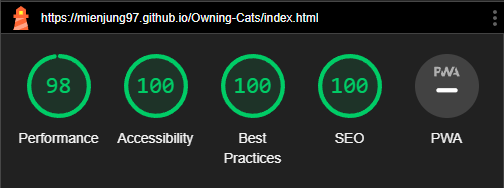
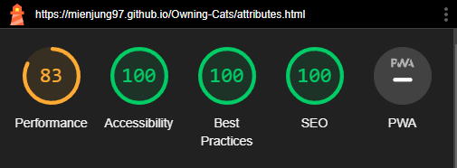
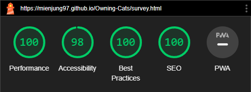

[Back to top](<#contents>)

## Browser Compatibility

Owning Cats website was tested on the following browsers with no visible issues for the user: 
- Google Chrome
- Microsoft Edge
- Mozilla Firefox 

Appearance, functionality and responsiveness were consistent throughout for a range of device sizes and browsers.

[Back to top](<#contents>)

# Credits

## Honorable mentions 
I have to thank my dear partner for being so patient since there is not a lot of free time and yet she fully supports me on a daily basis.  
I am also thankful for my co-student Marceillo, who I worked closly together and helped me in times of questioning.  
A big thank you goes out to the Tutors who have helped me along my first protfolio project: Alan and John helped me understand some problems, helped with technical problems and guided me towards a correct code. 

[Back to top](<#contents>)

## General reference: 
- The biggest help and inspiration in my first project was my Mentor Akshat Garg who helped me a lot with understanding .parent - .child connections, how to implement them in a long css code and media queries. 
- For the Header (Drop down menu) i took great inspiration from the "Love Running" project, the Footer has been compleatly copied since I really liked the design. Only for bigger screens, the Icons for the social media platforms move closer together.  
- For creating this readme, I have used example readme files from [Ewan Colquhoun](https://github.com/EwanColquhoun/wawaswoods/blob/master/README.md?plain=1#deployment) and my colleague [Marceillo](https://github.com/Marceillo) for the general overview.
- I used some help from YouTube tutorials from [EdRoh](https://www.youtube.com/watch?v=i1FeOOhNnwU) and [Slaying The Dragon](https://www.youtube.com/watch?v=phWxA89Dy94).

[Back to top](<#contents>)

## Content

- Font came from [Google Fonts](https://fonts.google.com/).
- Icons came from [Font Awesome](https://fontawesome.com/).
- Colors were created with [rgbacolorpicker](https://rgbacolorpicker.com/).
- The color palette was created with [Colors](https://coolors.co/gradient-palette/ffffff-f5f5f5?number=2).
- For creating the wireframes, I used [Balsamiq](https://balsamiq.com/wireframes/).
- For rezizing the images, the tool [Reduceimages](https://www.reduceimages.com/) was used.
- The responsive image was created with [Amiresponsive](https://ui.dev/amiresponsive).

[Back to top](<#contents>)

## Media

- Most of the images used for the hero, background image and cat breeds were taken from [Unsplash](https://unsplash.com/), the actual links are included as comments in the code.
- Two pictures were taken by me.
- The information about the cat breeds was taken from [litter-robot-blog](https://www.litter-robot.com/blog/breeds-of-cats/)

[Back to top](<#contents>)